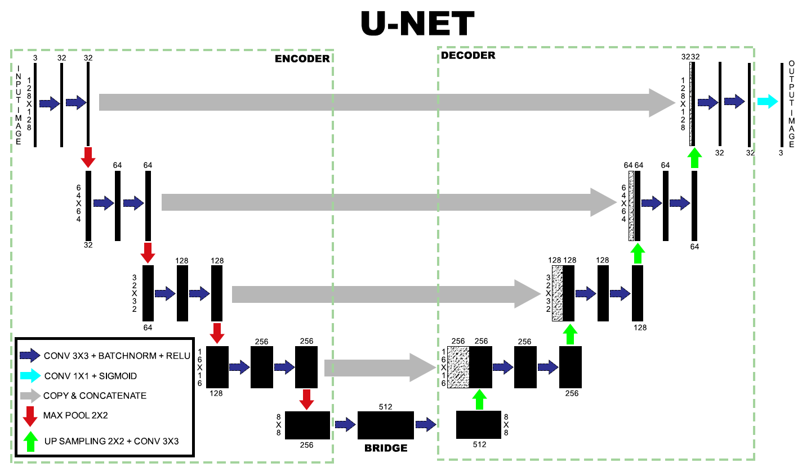

<h1 align="center"> Autoencoder </h1>

<p align="center">
    
    
    
</p>

----

# Pengantar Autoencoder

<p align="center">
    
</p>

- Autoencoder adalah model neural network yang memiliki input dan output yang sama.
- Autoencoder digunakan untuk mengurangi dimensi dari features (Dimensionality Reduction).

# Implementasi Autoencoder

1. Image Colorization

<p align="center">
    
</p>

2. Image Denoising

<p align="center">
    
</p>

3. Image Compression

<p align="center">
    
</p>

4. Super Resolution

<p align="center">
    
</p>

5. Shadow Removal 

<p align="center">
    
</p>

# Arsitektur Autoencoder (U-Net)

<p align="center">
    
</p>

UNET adalah arsitektur jaringan encoder-decoder berbentuk U, yang terdiri dari empat blok encoder dan empat blok decoder yang dihubungkan melalui sebuah jembatan (bridge).

1. Encoder

   | Convolution (Conv2D) | Max Pooling |
   | ---                  | ---         |
   |||
   
   Jaringan Encoder terdiri dari beberapa layer sebagai berikut.
   - Convolution (Conv2D): ektraksi ciri (feature extraction).
     ```
     layers.Conv2D(num_filters, kernel_size, padding)
     ```
   - Batch Normalization: mengurangi pergeseran kovarian atau menyamakan distribusi setiap nilai input yang selalau berubah karena perubahan pada layer sebelumnya selama proses training.
     ```
     layers.BatchNormalization()
     ```
   - Max Pooling: mengurangi dimensi (downsampling).
     ```
     layers.MaxPool2D(strides)
     ```
     
   Fungsi aktivasi ReLU (non-linearitas) membantu dalam generalisasi yang lebih baik dari data pelatihan. Karena membuat pembatas pada bilangan nol, artinya apabila x ≤ 0 maka x = 0 dan apabila x > 0 maka x = x.
   
   <p align="center">
     
   </p>
   
   ```
   layers.Activation('relu')
   ```
   
   Dibawah ini merupakan blok encoder.
   
   ```
   def encoder_block(input, num_filters):
      x = layers.Conv2D(num_filters, 3, padding='same')(input)
      x = layers.BatchNormalization()(x)
      x = layers.Activation('relu')(x)

      x = layers.Conv2D(num_filters, 3, padding='same')(x)
      x = layers.BatchNormalization()(x)
      x = layers.Activation('relu')(x)

      p = layers.MaxPool2D(2, 2)(x)

      return x, p
   ```
   

2. Bridge
   <p align="center">
    
   </p>

   Jembatan menghubungkan encoder dan jaringan decoder dan melengkapi aliran informasi.
   
   Dibawah ini merupakan bridge.
   
   ```
   def conv_block(input, num_filters):
      x = layers.Conv2D(num_filters, 3, padding='same')(input)
      x = layers.BatchNormalization()(x)
      x = layers.Activation('relu')(x)

      return x
   ```

3. Decoder

   | Conv2DTranspose | Concatenate |
   | ---                  | ---         |
   |||

   Jaringan Decoder terdiri dari beberapa layer sebagai berikut.
   - Conv2DTranspose: menambah dimensi (up sampling) dan konvolusi.
     ```
     layers.Conv2DTranspose(num_filters, kernel_size, strides, padding)
     ```
   - Concatenate: menggabungkan 2 array (tensor).
     ```
     layers.Concatenate()([skip_features, upconv])
     ```
   
   Skip connection / skip feature memberikan informasi tambahan yang membantu dekoder menghasilkan fitur output yang lebih baik. Skip connection / skip feature bertindak sebaagai koneksi jalan pintas yang membantu aliran gradien yang lebih baik saat back propagation, yang pada gilirannya membantu jaringan untuk mempelajari representasi yang lebih baik.
   
   Dibawah ini merupakan blok decoder.
   
   ```
   def decoder_block(input, skip_features, num_filters):
      upconv = layers.Conv2DTranspose(num_filters, 3, strides=(2, 2), padding="same")(input)
      upconv = layers.BatchNormalization()(upconv)
      upconv = layers.Activation('relu')(upconv)

      c = layers.Concatenate()([skip_features, upconv])

      y = layers.Conv2D(num_filters, 3, padding='same')(c)
      y = layers.BatchNormalization()(y)
      y = layers.Activation('relu')(y)
      
      y = layers.Conv2D(num_filters, 3, padding='same')(y)
      y = layers.BatchNormalization()(y)
      y = layers.Activation('relu')(y)

      return relu
   ```

4. Output

   <p align="center">
    
   </p>
   
   Output dari decoder terakhir melewati konvolusi 1x1 dengan aktivasi sigmoid. Fungsi aktivasi sigmoid memberikan topeng segmentasi yang mewakili klasifikasi berdasarkan piksel.
   
   ```
   layers.Conv2D(num_filter/channels, kernel_size, activation='sigmoid', padding='same')
   ```

# Evaluasi Model Autoencoder
Pada Autoencoder terdapat beberapa metrik yang dijadikan sebagai parameter dalam evaluasi sebuah model sebagai berikut.

- PSNR (Peak Signal-to-Noise Ratio)
  
  PSNR digunakan untuk memeriksa kesamaan atau perbedaan dua gambar.
  
  ```
  def psnr(pred, gt):
    return tf.image.psnr(pred, gt, max_val=1.0)
  ```

- SSIM
  
  SSISM digunakan untuk menilai kualitas gambar dari visibilitas kesalahan hingga kesamaan struktural.(Wang, Z., Bovik, A. C., Sheikh, H. R., & Simoncelli, E. P. (2004))
  
   ```
   def ssim(pred, gt):
     return tf.image.ssim(pred, gt, max_val=1.0)
   ```


---
Referensi:
- https://github.com/aayush9753/ColorIt
- https://medium.com/geekculture/u-net-implementation-from-scratch-using-tensorflow-b4342266e406
- https://colab.research.google.com/drive/1_X3bvVTqXenRf-7Uz6lLxc3dOuDmxzd7?usp=sharing
- https://github.com/christianversloot/machine-learning-articles/blob/main/how-to-build-a-u-net-for-image-segmentation-with-tensorflow-and-keras.md
- https://idiotdeveloper.com/unet-implementation-in-tensorflow-using-keras-api/
- https://idiotdeveloper.com/what-is-unet/
- http://amroamroamro.github.io/mexopencv/opencv/image_similarity_demo.html
- https://www.tensorflow.org/api_docs/python/tf/image/psnr
- https://www.tensorflow.org/api_docs/python/tf/image/ssim
